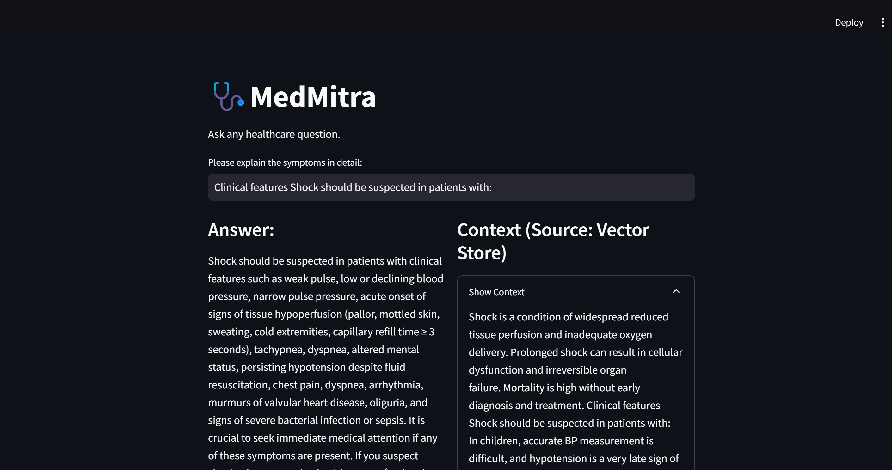
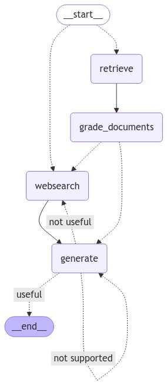

# Medical-AgenticRAG

## Project Description

The **Healthcare Assistant** is an advanced application designed to provide users with accurate diagnoses and treatment recommendations based on their queries and symptoms. Leveraging the power of Large Language Models (LLMs) and innovative Retrieval-Augmented Generation (RAG) techniques, our assistant ensures concise, factually correct answers while minimizing hallucinations.



## Features

- **Symptom-Based Diagnosis:** Users can input their symptoms or health-related queries to receive potential diagnoses and treatment suggestions.
- **Agentic RAG Architecture:** Implements an agentic RAG framework to enhance response accuracy and reliability.
- **Adaptive RAG Techniques:** Utilizes advanced methods such as Document Grading (CRAG), Generation Grading (Self-RAG), and Query Routing to improve information retrieval and response generation.
- **Streamlit Interface:** Provides a user-friendly interface built with Streamlit for seamless interaction.
- **Dockerized Deployment:** Easily deployable using Docker containers for consistent environments and simplified setup.


## Architecture

Our Healthcare Assistant is built upon a sophisticated architecture that integrates multiple advanced techniques to ensure high-quality responses:

1. **Agentic RAG Architecture:**
   - Ensures LLMs provide concise and factually correct answers.
   - Minimizes the risk of hallucinations by grounding responses in reliable data sources.

2. **Adaptive RAG Techniques:**
   - **Document Grading (CRAG):** Implements a self-grading mechanism for retrieved documents to refine search results and improve information quality.
   - **Generation Grading (Self-RAG):** Self-evaluates generated content to detect hallucinations and ensure answer relevance.
   - **Query Routing:** Directs different types of queries to the most appropriate retrieval or generation modules, optimizing accuracy and efficiency.

3. **LangGraph Integration:**
   - Utilizes LangGraph to create agents that enhance the application's accuracy and responsiveness.



## Technology Stack

- **Language Model:** GPT-4
- **Framework:** Streamlit
- **Architecture:** Agentic Retrieval-Augmented Generation (RAG)
- **Libraries:** LangGraph
- **Containerization:** Docker

## Installation

### Prerequisites

- [Docker](https://www.docker.com/get-started) installed on your local machine.
- Alternatively, [Python 3.8+](https://www.python.org/downloads/) and [pip](https://pip.pypa.io/en/stable/) if running locally without Docker.

### Using Docker

Follow these steps to build and run the Streamlit app using Docker:

1. **Repository Cloning**:
   ```
   git clone https://github.com/riteshhere/Medical-AgenticRAG.git
   cd Medical-AgenticRAG
   ```
2. **Build the Docker Image**:
   ```
   docker build -t Medical-AgenticRAG .
   ```
4. **Run the Docker Container**:
   ```
   docker run -d -p 8501:8501 --name healthcare-assistant-container healthcare-assistant
   ```
5. **Access the Application**:
   ```
   http://localhost:8501
   ```
